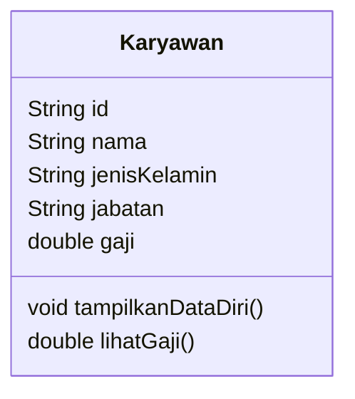

# Jobsheet 02 — Experiment 1: Creating a Class Diagram

## Case Study 1

A company manages employee data. Each employee has an ID, name, gender, position, and salary. An employee can display their personal data and view their salary.

> **Interpretation note:** The duplicated `jabatan` (position) and the word `mahasiswa` (student) in the jobsheet are treated as typographical errors. The subject of this case study is `Karyawan` (Employee).

## 1. Class Diagram

## 2. Identified Class

- `Karyawan` — represents an employee whose data is managed by the company.

Only one class is required because the case study describes a single entity and does not specify any relationship with another entity.

## 3. Attributes and Data Types

| Attribute | Data type | Description |
|---|---|---|
| `id` | `String` | Employee identifier. A string preserves possible leading zeroes and allows letters if needed. |
| `nama` | `String` | Employee name. |
| `jenisKelamin` | `String` | Employee gender. |
| `jabatan` | `String` | Employee position or role. |
| `gaji` | `double` | Employee salary. |

## 4. Methods

| Method | Return type | Description |
|---|---|---|
| `tampilkanDataDiri()` | `void` | Displays the employee's personal data. |
| `lihatGaji()` | `double` | Returns the employee's salary. |

Access modifiers are intentionally omitted because the jobsheet states that they are outside the scope of this material.
