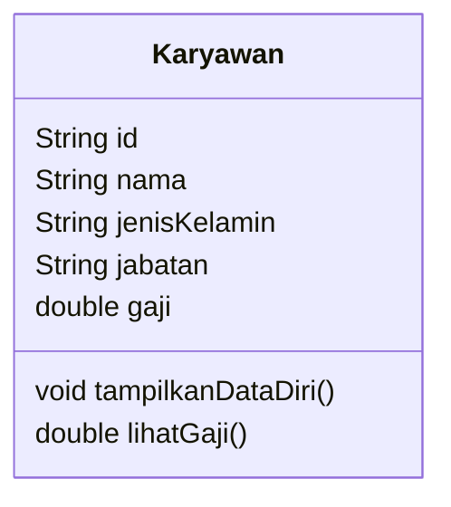
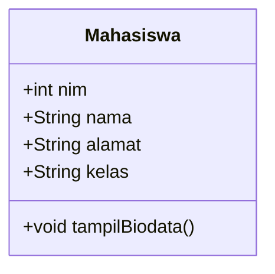

# Jobsheet 02 — Experiment 1: Creating a Class Diagram

## Case Study 1

A company manages employee data. Each employee has an ID, name, gender, position, and salary. An employee can display their personal data and view their salary.

> **Interpretation note:** The duplicated `jabatan` (position) and the word `mahasiswa` (student) in the jobsheet are treated as typographical errors. The subject of this case study is `Karyawan` (Employee).

## 1. Class Diagram



## 2. Identified Class

- `Karyawan` — represents an employee whose data is managed by the company.

Only one class is required because the case study describes a single entity and does not specify any relationship with another entity.

## 3. Attributes and Data Types

| Attribute | Data type | Description |
|---|---|---|
| `id` | `String` | Employee identifier. A string preserves possible leading zeroes and allows letters if needed. |
| `nama` | `String` | Employee name. |
| `jenisKelamin` | `String` | Employee gender. |
| `jabatan` | `String` | Employee position or role. |
| `gaji` | `double` | Employee salary. |

## 4. Methods

| Method | Return type | Description |
|---|---|---|
| `tampilkanDataDiri()` | `void` | Displays the employee's personal data. |
| `lihatGaji()` | `double` | Returns the employee's salary. |

Access modifiers are intentionally omitted because the jobsheet states that they are outside the scope of this material.


---

# Experiment 2 — Creating and Accessing Class Members

## Class Diagram



## Program Files

- `Mahasiswa.java` defines the attributes and the `tampilBiodata()` method.
- `TestMahasiswa.java` instantiates three `Mahasiswa` objects, assigns their attribute values, and displays their biodata.

## Answers to Questions 7–12

### 7. Where are the attributes declared?

The attributes are declared on lines 2–5 of `Mahasiswa.java`:

- `nim`
- `nama`
- `alamat`
- `kelas`

### 8. Where is the method declared?

The `tampilBiodata()` method is declared beginning on line 7 of `Mahasiswa.java`.

### 9. How many objects are instantiated?

The original example instantiates one object: `mhs1`. After completing question 12, the program instantiates three objects: `mhs1`, `mhs2`, and `mhs3`.

### 10. What does `mhs1.nim = 101` mean?

It assigns the integer value `101` to the `nim` attribute belonging to the `mhs1` object.

### 11. What does `mhs1.tampilBiodata()` do?

It calls the `tampilBiodata()` method on `mhs1`, which prints that object's NIM, name, address, and class.

### 12. Instantiate two more objects

Two additional objects, `mhs2` and `mhs3`, have been added to `TestMahasiswa.java`. Each object receives different attribute values and calls `tampilBiodata()`.

## Compile and Run

```bash
javac Mahasiswa.java TestMahasiswa.java
java TestMahasiswa
```
