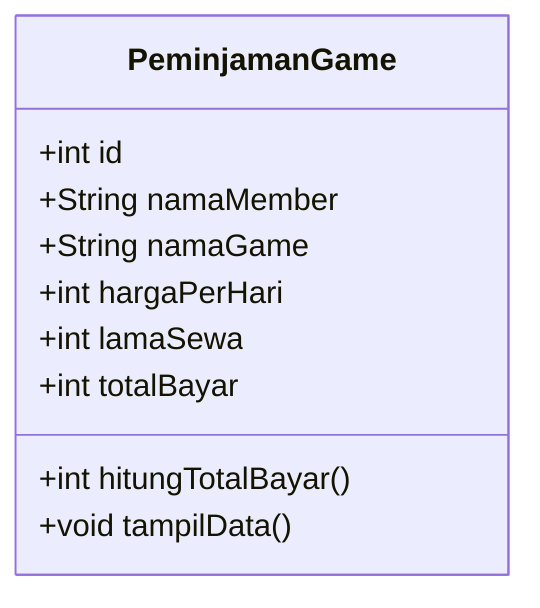
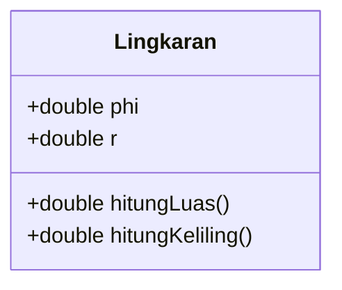
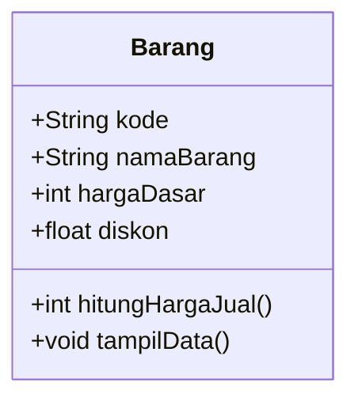

# Jobsheet 02 - 4.2 Assignments

Each exercise is isolated in its own folder so the assignment's `Barang` class does not conflict with the `Barang` class from Experiment 3.

## Assignments 1 and 2 - Video Game Rental

### Class Diagram



The amount to pay is calculated with:

```text
totalBayar = hargaPerHari * lamaSewa
```

The implementation is in `game-rental/PeminjamanGame.java`, with a runnable example in `game-rental/TestPeminjamanGame.java`.

## Assignment 3 - Circle

The implementation follows the supplied diagram:



The formulas are:

```text
luas      = phi * r * r
keliling  = 2 * phi * r
```

The implementation is in `circle/Lingkaran.java`, with a runnable example in `circle/TestLingkaran.java`.

## Assignment 4 - Discounted Product

The implementation follows the supplied diagram:



Because `diskon` is a percentage, the selling price is calculated with:

```text
hargaJual = hargaDasar - ((diskon / 100) * hargaDasar)
```

The implementation is in `product/Barang.java`, with a runnable example in `product/TestBarang.java`.
