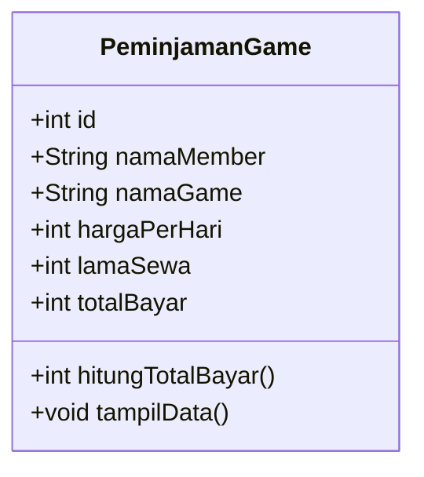
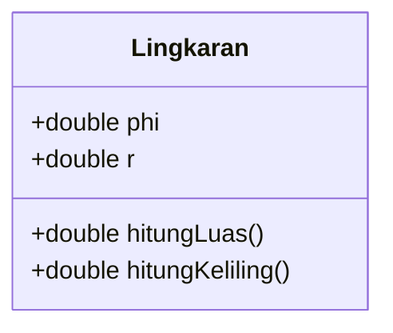
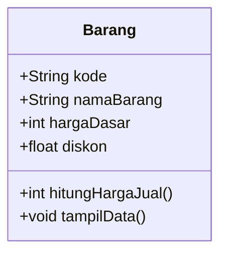

# 4.2 Assignments

## Assignments 1 and 2 - Video Game Rental

The first assignment asks for the class diagram; the second asks for its Java implementation.



Formula:

```text
totalBayar = hargaPerHari * lamaSewa
```

Files:

- [PeminjamanGame.java](assignment-01-02-game-rental/PeminjamanGame.java)
- [TestPeminjamanGame.java](assignment-01-02-game-rental/TestPeminjamanGame.java)

Expected total: `Rp45000`.

## Assignment 3 - Circle



Files:

- [Lingkaran.java](assignment-03-circle/Lingkaran.java)
- [TestLingkaran.java](assignment-03-circle/TestLingkaran.java)

Expected results for radius `7`:

- Area: `153.86`
- Circumference: `43.96`

## Assignment 4 - Discounted Product



Formula:

```text
hargaJual = hargaDasar - ((diskon / 100) * hargaDasar)
```

Files:

- [Barang.java](assignment-04-discounted-product/Barang.java)
- [TestBarang.java](assignment-04-discounted-product/TestBarang.java)

Expected selling price: `Rp85000`.

## Submission Document

[Download the DOCX containing all code and output screenshots](submission/Jobsheet-02-4.2-Assignments-Code-Screenshots.docx).
