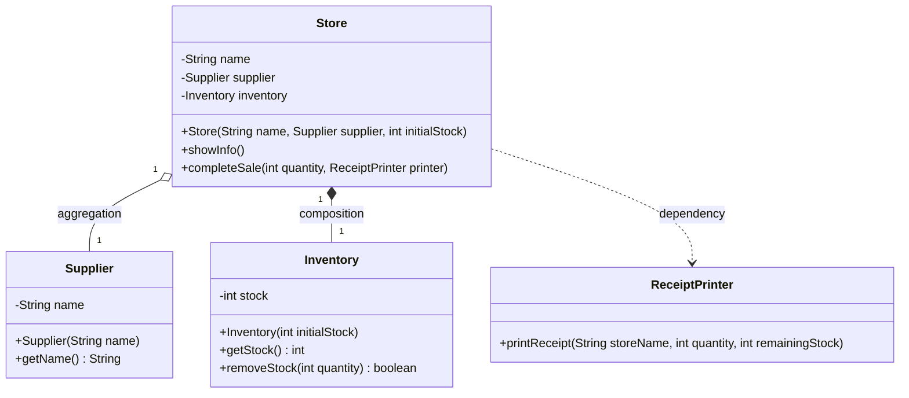

# Independent Assignment - Campus Store

## Case study

Campus Mart keeps an independently created supplier, owns its inventory, and temporarily uses a receipt printer when a sale succeeds. The four domain classes are `Store`, `Supplier`, `Inventory`, and `ReceiptPrinter`; `MainAssignment` is only the driver and is not counted.

## Class diagram

## Relationship evidence

### Aggregation: Store - Supplier

`MainAssignment` creates the supplier first, and `Store(String name, Supplier supplier, ...)` receives and stores that existing object. The supplier can still exist independently from the store.

### Composition: Store - Inventory

The `Store` constructor executes `this.inventory = new Inventory(initialStock);`. No inventory parameter or setter exists, so the store creates and owns its inventory.

### Dependency: Store - ReceiptPrinter

`completeSale(int quantity, ReceiptPrinter printer)` receives the printer only as a method parameter. `Store` has no `ReceiptPrinter` field, so it borrows the printer only while printing one receipt.

## Expected behavior

The program starts with 20 units, sells 3 units, and prints a receipt showing 17 units remaining. Invalid quantities or sales larger than the available stock are rejected.
