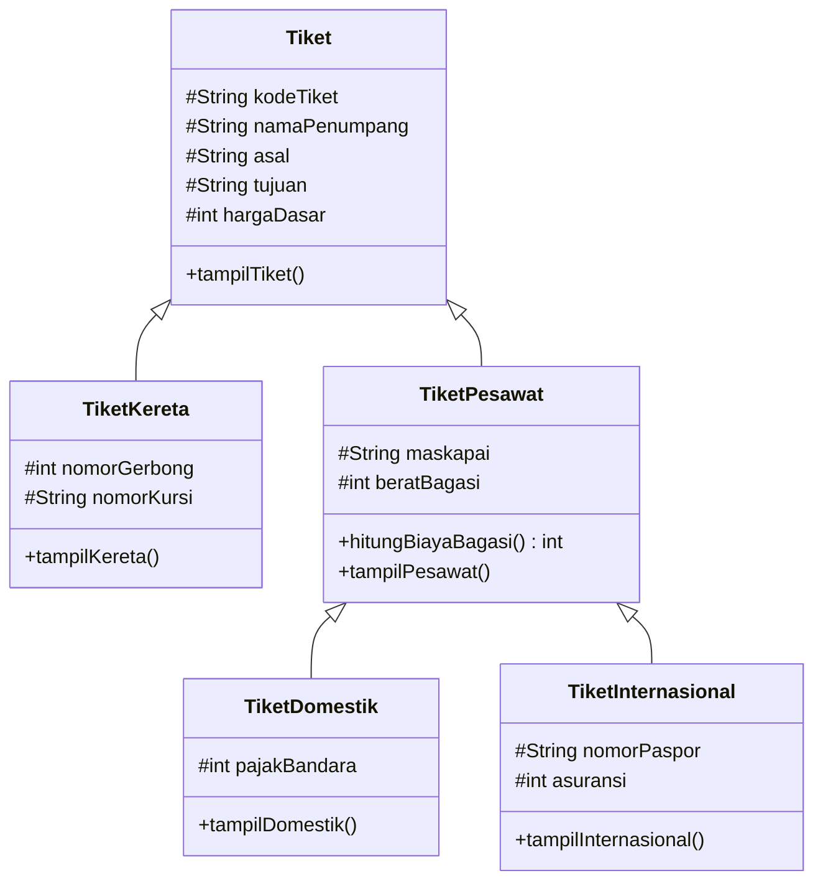

# Ticket Exercise

## Class hierarchy

## Required formulas

- Baggage charge: `max(0, beratBagasi - 20) * 50_000`.
- Train total: `hargaDasar`.
- Domestic total: `hargaDasar + hitungBiayaBagasi() + pajakBandara`.
- International total: `hargaDasar + hitungBiayaBagasi() + asuransi`.

## Requirement evidence

- Every parameterized child constructor begins by calling `super(...)`.
- Every specialized display method calls its parent's display method.
- `TiketKereta` in `TestTiket` uses the no-argument constructor, and its seven attributes are assigned one at a time.
- A 25 kg domestic bag produces `250000`; a 20 kg international bag produces `0`.
- Verified totals are `350000`, `1225000`, and `2650000`.
